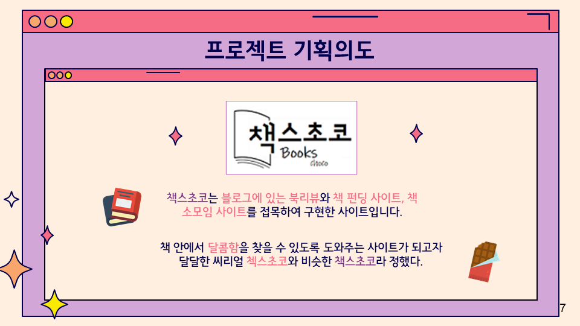
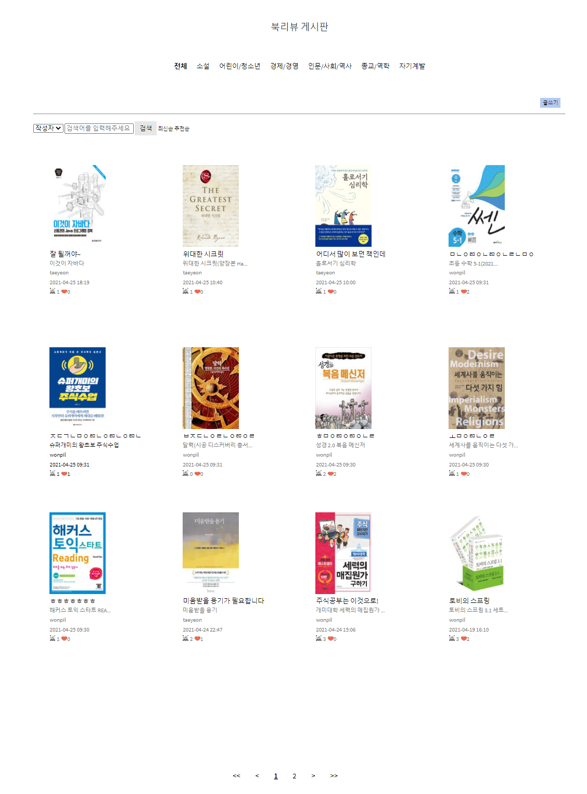
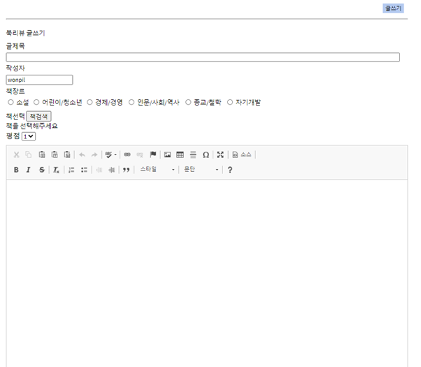
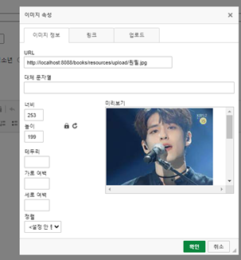
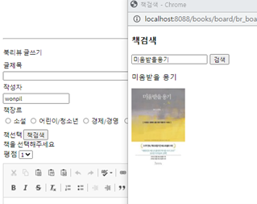
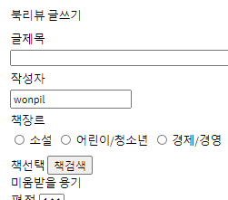
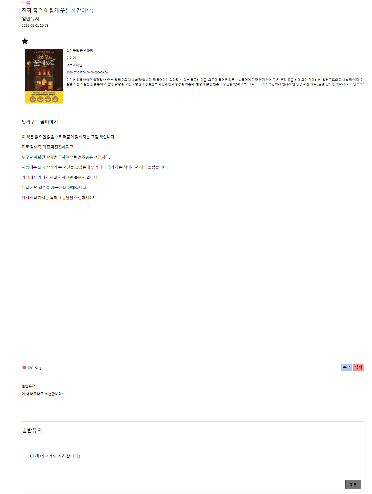

책스초코 (BooksChoco)
========
### KH정보교육원 파이널 프로젝트 3조
#### **김동민 김승현 문성준 박다슬 정수현**
###### 2021-03-31 ~ 2021-04-26
---------------------------------------
### 1. 기획의도
   

책스초코는 블로그에 있는 **북리뷰**와 **책 펀딩 사이트**, **책 소모임 사이트**를 접목하여 구현한 사이트입니다.

---------------------------------------

### 2. 개발환경 및 사용기술
   

* java 1.8
* spring 4.0
* Tomcat 9.0

---------------------------------------

### 3. 상세설명
   #### [메인페이지]
   ##### by. 문성준
   추후 추가
  
    
    
   
   #### [북리뷰게시판]
   ##### by. 박다슬

   
   > 북리뷰 게시판 전체화면

   + 카카오 검색 API를 사용해 DB에 이미지를 따로 저장하지 않고, 책 고유번호 (ISBN)만 DB에 저장해 리스트 불러올 때, ISBN을 통해 책표지를 불러올수 있도록 하였습니다.
         
   +  북리뷰 작성시 기입했던 책타입을 통해 소설, 어린이/청소년, 경제/경영, 인문/사회/역사, 종교/역학, 자기계발에 맞는 책을 리스트로 불러옵니다.
  
   +  작성자, 북리뷰제목, 내용 선택해서 검색 할수 있습니다.
  
   +  추천순, 최신순으로 정렬 가능합니다. (검색후 정렬은 계속 수정해 나가는 중)

 

   
   > 북리뷰 글쓰기

   + 스프링 시큐리티 권한 설정을 통해 로그인 했을 때만 글쓰기 버튼 보이게 설정하였습니다.
  
   +  CK에디터 적용해서 글 작성할수 있게 하였습니다.
   + ck에디터에서 그림 업로드도 가능합니다.
   + 책검색 버튼 누르면 책검생창이 새로 뜨고 책을 검색해서 클릭하면, 작성하던 페이지로 책제목이 들어갑니다.
    
    

     
> 북리뷰 상세보기

 + 북타입, 북리뷰제목, 글쓴이닉네임, 글쓴날짜가 있는 북리뷰 정보칸이 있고 책정보칸은 DB에 저장된 책 ISBN을 통해 카카오api에서 정보를 불러온 것입니다. (북리뷰썸네일과 같은 방법) 밑에는 ck에디터를 통해 저장한 내용을 그대로 불러오는 칸입니다.
 + 댓글기능 구현했습니다. 로그인 했을 때만 댓글 작성창이 나옵니다. Ajax로 구현했기 때문에 작성 후 바로 댓글이 등록되는 것을 볼 수 있습니다. 댓글 등록시 5글자 이상 입력 안하면 알림창 뜹니다. 최대 타이핑 수는 1000자 입니다.
 + Ajax로 좋아요 기능도 구현했습니다. 좋아요 버튼을 누르면 바로 옆에 숫자가 올라가는 것을 볼수 있습니다.

#### [북펀딩 게시판]
   ##### by. 김승현
   추후 추가

#### [북클럽 게시판]
   ##### by. 김동민
   추후 추가

#### [마이페이지]
   ##### by. 정수현
   추후 추가