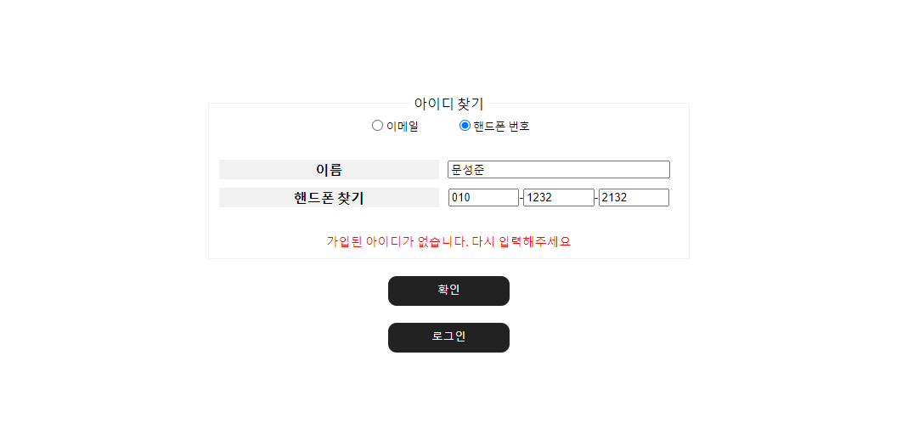
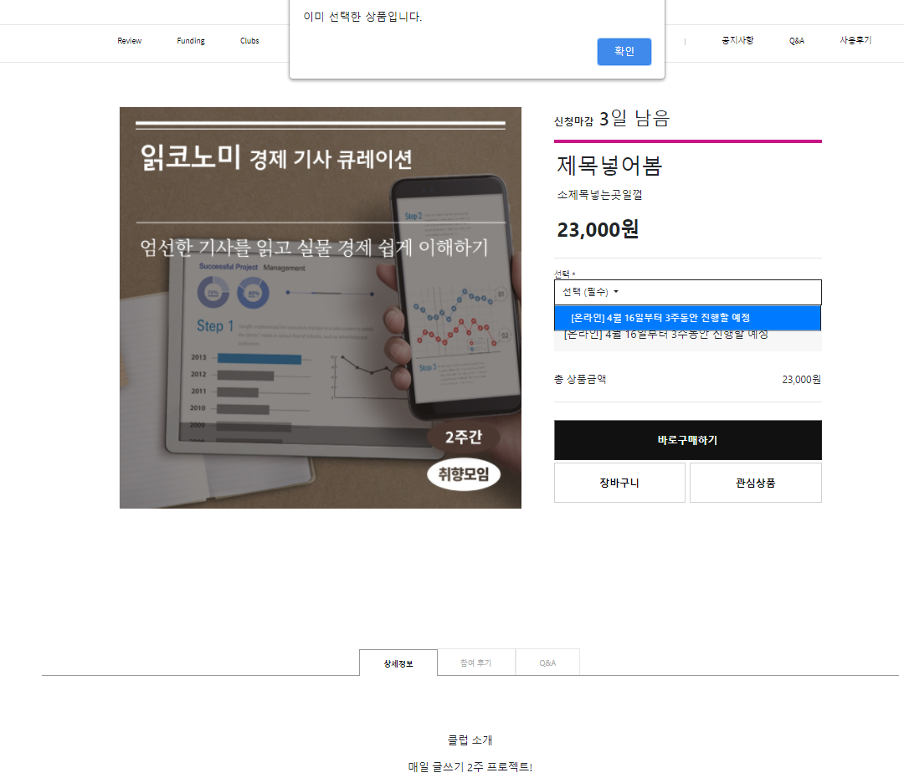
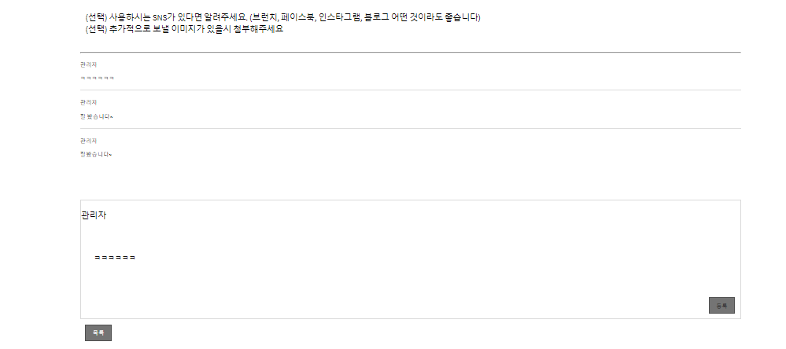
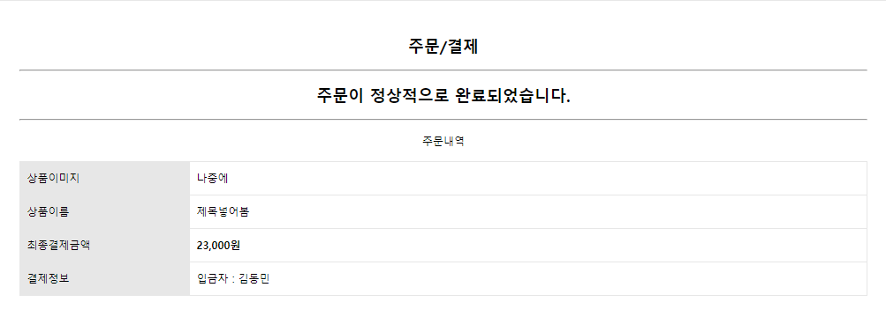

책스초코 (BooksChoco)
========
### KH정보교육원 파이널 프로젝트 3조
#### **김동민 김승현 문성준 박다슬 정수현**
###### 2021-03-31 ~ 2021-04-26
---------------------------------------
### 1. 기획의도
   

책스초코는 블로그에 있는 **북리뷰**와 **책 펀딩 사이트**, **책 소모임 사이트**를 접목하여 구현한 사이트입니다.

---------------------------------------

### 2. 개발환경 및 사용기술
   

* java 1.8
* spring 4.0
* Tomcat 9.0

---------------------------------------

### 3. 상세설명
   #### [메인페이지]
   ##### by. 문성준
   
   
   > 메인페이지 전체화면

   + 메인페이지에 북펀딩/북클럽 최신순으로 게시판 리스트를 불러와 좌우 버튼 클릭시 게시물 하나씩 보여줄수있도록 하였습니다.
         
   +  로그인 시 사용자가 회원가입 때 선택한 장르를 기준으로 리뷰가 많이 된 책의 정보를 메인페이지에 불러옵니다.
  
   +  해당 월과 작성된 리뷰게시물의 날짜를 비교하여 리뷰가 많이 된 책을 기준으로 월간도서로 추천합니다. (월 변경 시 리뷰게시물 데이터가 없으면 지난달 베스트로 정렬)
  
   +  장르선택 시 해당 장르의 리뷰게시물 중 추천 수가 많은 게시물을 불러옵니다.

 > 회원가입

   + 사용자의 편의성을 고려하여 정보 입력 시 바로 유효성 체크와 중복검사를 확인할 수 있게 하였습니다.
   
   + 모든 정보를 입력해야 회원가입이 가능하게 하였습니다.

 > 아이디 찾기

   + 이메일로 찾기/핸드폰 번호로 찾기를 선택할 수 있게 구현했습니다.
    
   + 해당하는 입력 정보가 존재하지 않으면 입력창 하단에 존재하지 않는 정보를 표시해줍니다. 
  

 > 비밀번호 찾기

   + 이름, 아이디, 이메일 주소 입력 시 계정정보가 존재하면 임시번호를 가입 시 기재한 이메일로 전송하게 구현하였습니다.

   + 해당하는 입력 정보가 존재하지 않으면 입력창 하단에 존재하지 않는 정보를 표시해줍니다.
  
   
   #### [북리뷰게시판]
   ##### by. 박다슬

   
   > 북리뷰 게시판 전체화면

   + 카카오 검색 API를 사용해 DB에 이미지를 따로 저장하지 않고, 책 고유번호 (ISBN)만 DB에 저장해 리스트 불러올 때, ISBN을 통해 책표지를 불러올수 있도록 하였습니다.
         
   +  북리뷰 작성시 기입했던 책타입을 통해 소설, 어린이/청소년, 경제/경영, 인문/사회/역사, 종교/역학, 자기계발에 맞는 책을 리스트로 불러옵니다.
  
   +  작성자, 북리뷰제목, 내용 선택해서 검색 할수 있습니다.
  
   +  추천순, 최신순으로 정렬 가능합니다. (검색후 정렬은 계속 수정해 나가는 중)

 

   
   > 북리뷰 글쓰기

   + 스프링 시큐리티 권한 설정을 통해 로그인 했을 때만 글쓰기 버튼 보이게 설정하였습니다.
  
   +  CK에디터 적용해서 글 작성할수 있게 하였습니다.
   + ck에디터에서 그림 업로드도 가능합니다.
   + 책검색 버튼 누르면 책검생창이 새로 뜨고 책을 검색해서 클릭하면, 작성하던 페이지로 책제목이 들어갑니다.
    
    

     
> 북리뷰 상세보기

 + 북타입, 북리뷰제목, 글쓴이닉네임, 글쓴날짜가 있는 북리뷰 정보칸이 있고 책정보칸은 DB에 저장된 책 ISBN을 통해 카카오api에서 정보를 불러온 것입니다. (북리뷰썸네일과 같은 방법) 밑에는 ck에디터를 통해 저장한 내용을 그대로 불러오는 칸입니다.
 + 댓글기능 구현했습니다. 로그인 했을 때만 댓글 작성창이 나옵니다. Ajax로 구현했기 때문에 작성 후 바로 댓글이 등록되는 것을 볼 수 있습니다. 댓글 등록시 5글자 이상 입력 안하면 알림창 뜹니다. 최대 타이핑 수는 1000자 입니다.
 + Ajax로 좋아요 기능도 구현했습니다. 좋아요 버튼을 누르면 바로 옆에 숫자가 올라가는 것을 볼수 있습니다.

#### [북펀딩 게시판]
   ##### by. 김승현

   
   > 북펀딩 게시판 전체화면

   + Funding을 클릭하고 4*3 형태의 List가 나타나고 제목 순으로 내림차순한 형태를 보여줍니다. 인기 프로젝트, 마감임박 프로젝트, 마감된 프로젝트를 조회할 수 있습니다. 게시글마다 달성률과 제목, 가격, 남은 기간을 확인할 수 있습니다.

   + 인기 프로젝트의 경우 쿠키를 이용한 조회수 증가 방법을 사용하여 조회수가 많은 순으로 내림차순하여 게시글을 확인할 수 있습니다. 이 때 조회수 반복 클릭을 방지하는 코드를 추가하여 조회수 반복을 방지하였습니다.

   
   > 북펀딩 게시판 마감 및 달성률, 남은 날짜 구성

   + Funding List를 불러올 때 달성률과 남은 날짜를 계산하여 반영하도록 했습니다.

   + 마감 시간과 현재 시간을 비교하여 마감 시간이 지나게 되면 DB의 STATUS를 'Q'로 바꿔 마감되도록 했습니다.

   
   > 북펀딩 게시판 검색과 페이징 처리

   + 제목과 상세내용에 해당하는 검색어를 통해 검색할 수 있고 4*3 List 이상이면 페이징 처리를 통해 확인할 수 있습니다. (ex: 13번째 게시글 부터는 2페이지에서 확인할 수 있습니다.)

   
   > 북펀딩 프로젝트 신청하기의 흐름(관리자의 승인, 반려 및 수정가능)

   + 북펀딩 프로젝트는 일반회원 누구나 신청이 가능하고 프로젝트 신청약관을 동의해야 작성할 수 있습니다. 신청 후 바로 List에 올라가는 것이 아니라 관리자가 프로젝트의 내용을 확인하고 승인을 해줘야 List에 올라갈 수 있도록 구성했습니다.

   + 관리자는 북펀딩 목록을 관리자 페이지에서 확인할 수 있습니다. 일반회원은 마이페이지에서 목록을 확인할 수 있습니다. (이 부분들은 정수현님이 맡은 관리자 페이지, 마이 페이지에서 협업을 통해 구성했습니다.)

   + 관리자는 북펀딩 프로젝트의 상세 내용을 확인할 수 있고 승인 or 반려(거절), 관리자 코멘트를 남길 수 있습니다.

   + 북펀딩 프로젝트 신청자는 관리자가 처리한 승인 or 반려(거절), 관리자 코멘트를 마이페이지에서 확인할 수 있고, 거절된 프로젝트의 경우 수정 후 다시 재신청을 할 수 있습니다. 기존 신청했던 프로젝트도 내용을 수정할 수 있습니다.

   
   > 북펀딩 프로젝트 펀딩하기(결제하기)

   + 결제하기 페이지는 I'mport API를 적용하여 구현했습니다. 결제하기 화면은 반응형 페이지이며 화면이 줄어들면 상단 이미지 왼쪽 화면처럼 바뀝니다.

   + 카카오페이로 test 결제가 성공하면 회원정보가 I'mport의 관리자 페이지에 전송되고 관리자는 결제상태를 확인할 수 있습니다. 결제가 성공한 이용자는 주문조회를 통해 결제내역을 확인할 수 있습니다.

#### [북클럽 게시판]
   ##### by. 김동민
   
   > 북클럽 게시판 메인화면

   + 전체 클럽 조회 시 진행중인(모집 마감 && bcRemainDate<0 && Status='Q')클럽 클릭 시 alert('마감된 클럽입니다.')
   + 모집 진행중인 클럽 조회(모집 진행중 && bcRemainDate && Status='Y')하면, 상세페이지(bcBoardDetail.jsp)로 이동
   + 진행중인(모집 마감된)클럽은 BootStrap.js을 사용하여 4개의 게시물 AutoSlide 기능을 추가
   + 모집 진행중인 게시물(listLimit=12) 페이징 처리

   
   > 북클럽 게시판 작성하기

   + 게시판 작성은 관리자만 가능하게 설정
   
   
   > 북클럽 게시판 상세페이지
   
   + 상세페이지 구매하기 전 선택 필수(dragdrop.js) 선택 안하고 구매하기 시 alert('일정을 선택해주세요') 
     같은 일정 선택 시 alert('이미 선택된 일정입니다.')
   
   > 북클럽 게시판 상세페이지 후기작성
   
   + 후기 작성은 일반 게시판 형태에 섬네일 이미지, 제목, 내용만 넣을 수 있게 구현
   
      
   > 북클럽 제안하기

   + (관리자 || 작성자)를 제외한 사용자는 비밀글로 설정해놓고, secret.jsp(자식 창)에서 비밀번호를 대조하여 일치하면 
     alert('비밀번호가 일치합니다.') 이후 상세페이지(bcBoardDetail.jsp)로 이동
   + 제안하기 게시글 등록 후 관리자가 댓글을 다는 순서로 구성
   
    
   > 북클럽 결제하기
   
   + 북펀딩과 동일한 원리로 작동
   
#### [마이페이지]
   ##### by. 정수현
   추후 추가
